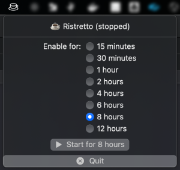
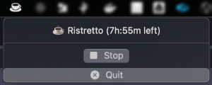

# Ristretto
Why do we need yet another app to keep our Mac awake? Well, it's simple. 
You see, Macs are like cats. They have this uncanny ability to fall asleep at 
the most inconvenient times. You're in the middle of an important Zoom meeting, 
and suddenly your Mac decides it's naptime! So, I created this app to give 
your Mac a strong cup of virtual coffee and keep it wide awake.

Now, instead of your Mac catching some Z's, it'll be catching some LOLs as you 
wonder why we keep inventing solutions for problems we didn't even know we had! 😂☕💤

## Last Release
https://github.com/oizmerly/ristretto/tree/main/release

## Screenshots




## Build
```sh
make build-release
```
The binary is at `./build/Release/Ristretto.app`
